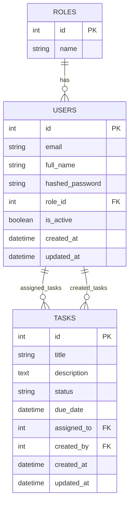

# Database ERD

## Relationships

- `users.role_id` references `roles.id`
- `tasks.assigned_to` references `users.id`
- `tasks.created_by` references `users.id`

## Notes

- Each user has one role.
- Each role can belong to many users.
- A task can be assigned to one user.
- A task is created by one user.
- `assigned_to` may be nullable if a task is created before assignment.
- `created_by` is required because every task must have a creator.
